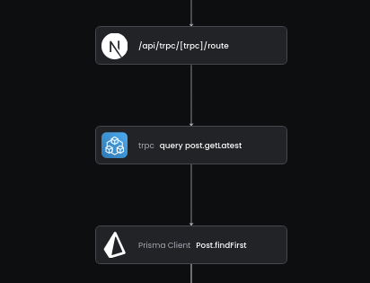

# TRPC OpenTelemetry Middleware

Trace your TRPC Applications. If you don't use OpenTelemetry yet please see [The Baselime Docs](https://baselime.io/docs/sending-data/opentelemetry)

<p align="center">
  
</p>


## Installation

```bash
npm i @baselime/trpc-opentelemetry-middleware
```

## Setup

Add the Middleware to the procedures you want to trace

```typescript
// trpc.ts
import { tracing } from "@baselime/trpc-opentelemetry-middleware";

const t = initTRPC.context<typeof createTRPCContext>().create({
  ...
});

// add the middleware to all the procedures you want to trace
export const publicProcedure = t.procedure.use(tracing({ collectInput: true }))
```
